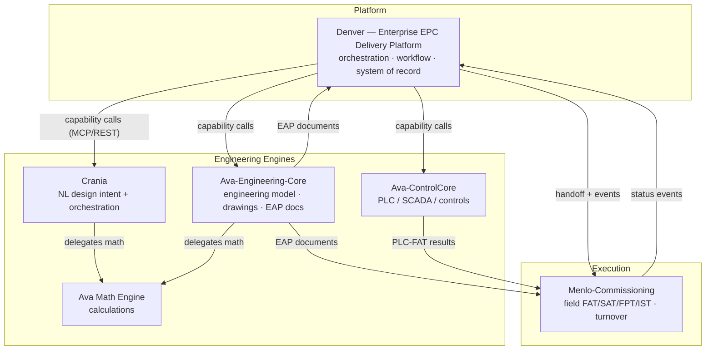
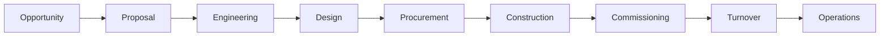
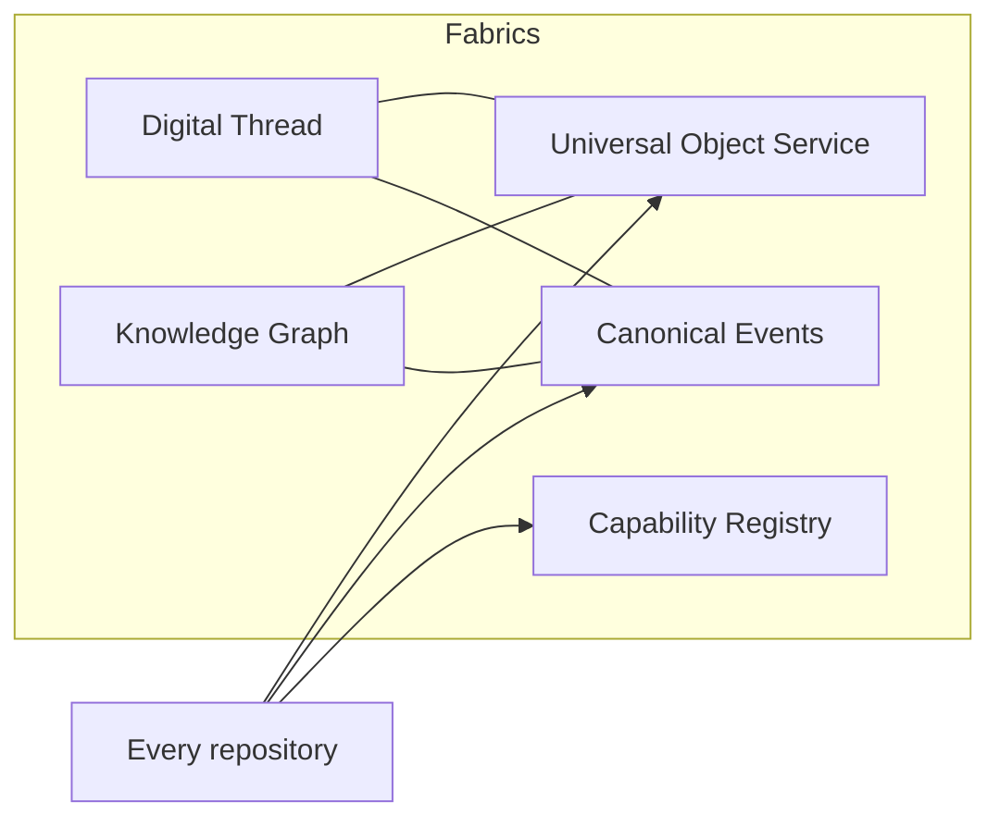
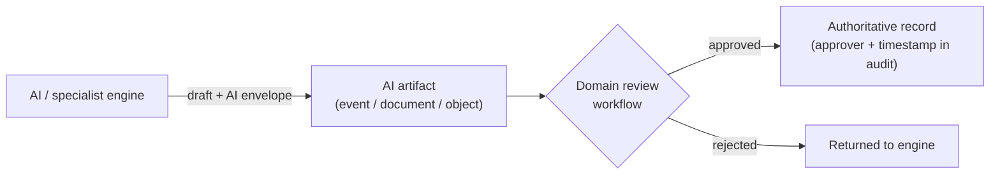
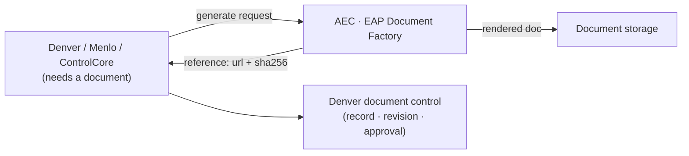
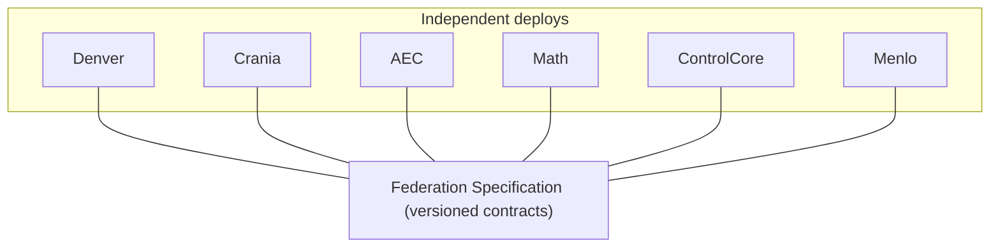
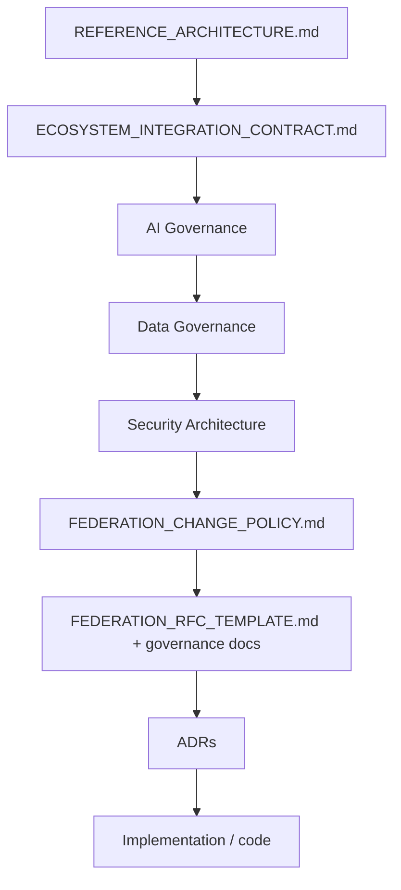
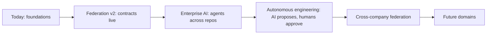

# Reference Architecture — Ava EPC Federation v2.0

**The master architectural front door for the entire AI-native EPC ecosystem.**
Read this first. It explains *what* the ecosystem is and *how* it fits together, then points to the
detailed specifications. It deliberately **summarizes and links** — it does not restate full specs.

Status: v2.0 (2026-06-27) · Implementation-agnostic · Stable reference.
Canonical detail lives in `ECOSYSTEM_INTEGRATION_CONTRACT.md` and the governance docs (see §12, §13).

---

## 1. Executive Overview

The Ava EPC ecosystem is a **federation**: a set of independently deployable repositories that behave like
one intelligent platform. **Denver** is the Enterprise EPC Delivery Platform the user experiences;
specialist engines (Crania, Ava-Engineering-Core, Ava Math Engine, Ava-ControlCore, Menlo-Commissioning)
own technical execution behind it.

Principles:
- **AI-native** — AI is embedded in every repository, not bolted on; every AI artifact carries provenance
  and is gated by human review (§6, ADR-009).
- **Federation, not monolith** — repositories interoperate through **stable, versioned contracts**, never
  by reaching into each other's databases.
- **One owner per capability** — no duplicated ownership (§3, ADR-002).
- **Manage vs execute** — Denver owns workflow and lifecycle; engines compute/render/execute (ADR-001).
- **Independent deployability** — each repo ships on its own schedule behind feature flags; the federation
  never requires synchronized releases.
- **Evolvable** — change is governed by RFC + semantic versioning so the platform can grow for years
  without a rewrite (§12).

The result: a modular, AI-native platform that orchestrates engineering, procurement, construction, and
commissioning end-to-end while each specialist domain evolves on its own.

---

## 2. Ecosystem Map

Denver orchestrates; specialists execute; everything interoperates through the five federation fabrics
(§5).

Read the edges as: **Denver requests capabilities** and **hands off** to execution; **engines delegate**
math to one place; **AEC is the document authority**; **status flows back** to Denver as canonical events.

---

## 3. Repository Responsibilities

Detail: `ECOSYSTEM_INTEGRATION_CONTRACT.md` §1, §10, §13 and ADR-001/002. Summary:

| Repository | Mission | Owns | Never owns | Primary capabilities | Public interfaces | Depends on | Future direction |
|---|---|---|---|---|---|---|---|
| **Denver** | Enterprise EPC delivery platform | EPC business workflow, project/portfolio, procurement, construction, cost/schedule/quality/risk, document control, turnover planning, executive reporting, orchestration, digital-thread index | calculations, PLC, field commissioning, document rendering | orchestration, capability routing, dashboards, AI PM | REST `/api/v1`, events, MCP (provider + consumer), webhooks | all engines (via capabilities) | host the Universal Object Service; deepen AI PM |
| **Crania** | NL engineering front door | design intent, design orchestration | the calculation engine | intent extraction, design interpretation | MCP tools, REST | Math Engine, AEC | broaden disciplines |
| **Ava-Engineering-Core** | Engineering source of truth + doc authority | canonical EngineeringModel, drawing intelligence, engineering calcs, **EAP Document Factory** | project orchestration, field execution | model build, drawing review, doc generation | MCP tools, REST `/api/doc-factory/*` | Math Engine | richer model + EAP coverage |
| **Ava Math Engine** | Pure computation | every engineering calculation | UI, workflow, persistence | sizing, hydraulics, structural, electrical | MCP tools | — | more calculation domains |
| **Ava-ControlCore** | Controls specialist | PLC/SCADA gen/review/conversion, controls FAT, PLC commissioning | field commissioning | PLC codegen, P&ID, comms, controls docs | REST (MCP shim planned) | AEC (model), EAP (docs) | MCP provider; deeper validation |
| **Menlo-Commissioning** | Field commissioning execution | pre-comm, loop checks, FAT/SAT/FPT/IST, punch, deficiencies, NCR/CAPA, witnessing, turnover, readiness | engineering calcs, PLC generation | test execution, evidence, witness, turnover | REST, MCP bridge, events | Denver (handoff), EAP (docs) | persistence + ingest of Denver bootstrap |

---

## 4. Enterprise EPC Lifecycle

One continuous lifecycle; each stage has an owning system.

| Stage | Primary owner | Specialist engines involved |
|---|---|---|
| Opportunity / Proposal | **Denver** | — |
| Engineering (management) | **Denver** | Crania (intent), AEC (model/review), Math (calcs) |
| Design (technical) | **AEC** | Crania, Math, ControlCore (controls) |
| Procurement | **Denver** | — |
| Construction | **Denver** | — |
| Commissioning | **Menlo** | ControlCore (PLC-FAT feeds Menlo) |
| Turnover | **Denver** (planning) + **Menlo** (execution evidence) | AEC/EAP (turnover package) |
| Operations | downstream (FacilityHub / EstateOps, future) | — |

Denver **manages** every stage's workflow + records; specialists **execute** the technical work
(ADR-001/002). Documents at every stage are produced by EAP (§9).

---

## 5. Federation Integration Fabrics

The only ways repositories communicate. Detail: `ECOSYSTEM_INTEGRATION_CONTRACT.md` §3–§7.

| Fabric | Purpose | Owner / Host | Consumers | Maturity | Roadmap |
|---|---|---|---|---|---|
| **Universal Object Service** (§3) | one immutable UUID per object; issuance + resolution + lifecycle | Denver hosts; minting per type (ADR-003) | all repos | vocabulary + minting guardrails shipped; **service is follow-up** | persistent store + resolution API + merge/supersede/tombstone |
| **Canonical Events** (§4) | versioned shared event vocabulary; edge-mapped | publishers/subscribers; Denver edge adapter shipped | all repos | edge adapter + envelope shipped; **`spec_version` follow-up** | broker transport; payload schemas |
| **Capability Registry** (§5) | ask for a capability, not a URL | Denver | Denver → engines | resolution + fallback shipped (flag) | health checks + version negotiation |
| **Digital Thread** (§6) | lifecycle traceability via UUID refs | Denver index; hops asserted by owners | all repos | in-memory traversal shipped | persistence + provenance + auto-contribution |
| **Knowledge Graph** (§7) | semantic relationships for AI reasoning | Denver index; edges from all repos | AI agents, search | in-memory graph shipped | persistent governed graph + provenance |

---

## 6. AI Architecture

AI is embedded everywhere and governed uniformly. Detail: `ECOSYSTEM_INTEGRATION_CONTRACT.md` §11 (the AI
Governance Contract; a dedicated `AI_GOVERNANCE.md` may be extracted later) and ADR-009.

- **AI agents** (e.g. Denver's AI PM, Menlo's copilot) **advise and draft**; they never self-approve.
- **Specialist engines** apply domain AI (design interpretation, drawing extraction, PLC gen) and attach
  citations/provenance.
- **Human approvals** gate authority: *no AI-generated engineering output is authoritative until reviewed
  or approved per the owning domain's workflow.*
- **Uniform AI artifact envelope** travels with every AI output (events, documents, registry objects):
  model provider/name/version, prompt version, confidence, reasoning summary, citations, evidence refs,
  review status, approver, approved_at, generated_at, correlation_id.

Decision accountability: the **owning domain** (per §1/§10) defines the review workflow and records the
human approver in the envelope and the audit trail.

---

## 7. Security Architecture

Summary; detail in `ENTERPRISE_SECURITY_SPEC.md` and `ECOSYSTEM_INTEGRATION_CONTRACT.md` §9 (a consolidated
`SECURITY_ARCHITECTURE.md` may be extracted later). Principles fixed by **ADR-010**:

- **Authentication** — JWT/OIDC for users; signed service tokens (or mTLS) with scopes for service-to-
  service federation calls.
- **Authorization / RBAC** — on all privileged actions.
- **Row-Level Security** — tenant isolation enforced at the data layer (non-owner DB role), not only in app
  code.
- **Signed webhooks** — HMAC-SHA256, constant-time compare, for inbound events.
- **Audit** — immutable trail for mutations and approvals (including AI approvals).
- **Secrets** — rotation policy; least-privilege credentials.
- **Service identity / trust boundaries** — `tenant_id` and registry UUIDs are authoritative as issued; no
  repo re-derives them; zero implicit network trust.

---

## 8. Data Architecture

Summary; detail in `ECOSYSTEM_INTEGRATION_CONTRACT.md` §3/§3.1 (a dedicated `DATA_GOVERNANCE.md` may be
extracted later) and **ADR-003**.

- **Universal Object Service** is the system of record for identity.
- **Canonical UUIDs** — one immutable id per object, minted by its owner; never reused or mutated.
- **Ownership** — per the minting-authority table (Denver / AEC / Menlo own distinct object types).
- **External IDs / aliases** — vendor, customer, and human identifiers map to the canonical UUID.
- **Legacy migration** — pre-federation ids (e.g. Menlo `externalId`) map forward; identity preserved.
- **Lifecycle** — change via `superseded-by` / `merged-into` / `tombstoned`, never by mutating a UUID.
- **Reference rule** — repos store `*_uuid` references and resolve through the UOS; never copy or cross-read.

---

## 9. Document Architecture

Detail: `ECOSYSTEM_INTEGRATION_CONTRACT.md` §10 and **ADR-008**.

- **EAP (in AEC) is the single document authority.** Producers render; consumers store a **reference**
  (URL + sha256), never bytes.
- **Engineering documents** (FDS, SOO, datasheets), **commissioning documents** (FAT/SAT/FPT procedures,
  reports, turnover packages), and **controls documents** (ControlCore source artifacts) all register
  through EAP — one citation model, one template system.
- **Document control** (the record, revision, approval workflow, status) is owned by **Denver**;
  **generation** is owned by **EAP** (manage vs generate).
- **Versioning / approval / storage** — documents are versioned, approval-gated, and AI-generated documents
  carry the AI envelope (§6).

---

## 10. Communication Architecture

Detail: `ECOSYSTEM_INTEGRATION_CONTRACT.md` §4–§5, §8. When to use which:

| Mechanism | Use it for |
|---|---|
| **REST** | synchronous queries/commands with a request/response and a defined resource |
| **Events** | asynchronous state changes / lifecycle facts that fan out to many consumers |
| **MCP** | capability invocation by AI agents and cross-engine calls (tool semantics) |
| **OpenAPI** | describing/discovering a repo's REST surface |
| **Webhooks** | delivering events across repository/network boundaries (HMAC-signed) |
| **Capability Registry** | resolving *which provider* serves a capability before an MCP/REST call |

Rule of thumb: **command/query → REST or MCP; fact/notification → Events; discovery → Capability Registry
+ OpenAPI.**

---

## 11. Deployment Architecture

Detail: `FEDERATION_RELEASE_POLICY.md`, `FEDERATION_CHANGE_POLICY.md`.

- **Independent repositories**, **independent deployment** — no synchronized releases.
- **Shared federation contracts** are the only coupling; they are **versioned** (semver of the Federation
  Specification).
- **Feature flags** gate every federation feature (default off) so adoption is incremental and reversible.
- **Version compatibility** — additive-by-default; breaking changes require a new major + coexistence
  period; **consumers ignore unknown fields**.
- **Backward compatibility** — supported window across minors + LTS (release policy).

---

## 12. Governance

How architecture evolves. Detail in the governance docs:
- **Change Policy** — `FEDERATION_CHANGE_POLICY.md` (semver, compatibility, approval matrix, breaking-change
  policy, compliance levels).
- **RFC Process** — `FEDERATION_RFC_TEMPLATE.md` (every federation-wide change).
- **Compliance** — `FEDERATION_COMPLIANCE_CHECKLIST.md`.
- **Lifecycle** — `FEDERATION_LIFECYCLE.md` (Draft → … → Retired).
- **Release** — `FEDERATION_RELEASE_POLICY.md` (cadence, support window, LTS).
- **ADRs** — `docs/adr/` (foundational decisions, immutable once accepted; superseded, not rewritten).

No federation contract changes silently: propose (RFC) → review (approval matrix) → version → migrate.

---

## 13. Document Hierarchy (precedence)

When two documents disagree, the **higher** authority wins.

1. **REFERENCE_ARCHITECTURE.md** (this document) — the front door.
2. **ECOSYSTEM_INTEGRATION_CONTRACT.md** — the normative contracts.
3. **AI Governance** — currently `ECOSYSTEM_INTEGRATION_CONTRACT.md` §11 *(planned extraction:
   `AI_GOVERNANCE.md`)*.
4. **Data Governance** — currently `ECOSYSTEM_INTEGRATION_CONTRACT.md` §3/§3.1 *(planned extraction:
   `DATA_GOVERNANCE.md`)*.
5. **Security Architecture** — `ENTERPRISE_SECURITY_SPEC.md` + `ECOSYSTEM_INTEGRATION_CONTRACT.md` §9
   *(planned consolidation: `SECURITY_ARCHITECTURE.md`)*.
6. **FEDERATION_CHANGE_POLICY.md** — governance constitution.
7. **FEDERATION_RFC_TEMPLATE.md** + lifecycle/release/adoption/compliance docs.
8. **ADRs** (`docs/adr/`).
9. **Implementation / code**.

> Note: items 3–5 currently live as sections of `ECOSYSTEM_INTEGRATION_CONTRACT.md` and
> `ENTERPRISE_SECURITY_SPEC.md`; the standalone files are *planned extractions*. Until they exist, cite
> the section. Precedence is by **role**, not by file existence.

---

## 14. Repository Onboarding (one page)

To join the federation a repository must support (detail + checklists in `FEDERATION_ADOPTION_GUIDE.md`,
certified via `FEDERATION_COMPLIANCE_CHECKLIST.md`):

- [ ] **Universal Object Service** — reference shared objects by UUID; resolve via the UOS; mint only owned types.
- [ ] **Canonical Events** — publish/subscribe with `spec_version`; idempotent consumers; ignore unknown fields.
- [ ] **Capability Registry** — register provided capabilities (with health + version).
- [ ] **AI Governance** — AI envelope on every AI artifact; nothing authoritative until reviewed/approved.
- [ ] **Security** — JWT/OIDC, RBAC, RLS, signed webhooks, audit, rotation, least privilege.
- [ ] **OpenAPI** — publish `/openapi.json`.
- [ ] **MCP** — provider and/or consumer.
- [ ] **Health** — liveness/readiness + version.
- [ ] **Observability** — logs/metrics/events feeding the thread + graph.
- [ ] **Compliance** — pass the checklist; declare compliance level (1/2/3).

Onboarding is **implementation, not redesign** — provided the contracts are at the targeted version.

---

## 15. Architecture Roadmap (implementation-agnostic)

- **Today → Federation v2:** primitives shipped (dormant/flag-gated); operationalize the UOS, event
  versioning, capability health, persistent thread/graph.
- **Enterprise AI:** AI agents coordinate across repos under the AI Governance envelope.
- **Autonomous engineering:** AI drafts more of the work; humans remain the approval authority.
- **Cross-company federation:** the same contracts span organizations.
- **Future domains:** Operations, Facilities, Asset Management, Finance onboard as new repositories.

---

## 16. Glossary

| Term | Meaning |
|---|---|
| **Federation** | independently deployable repositories interoperating through shared, versioned contracts. |
| **Repository** | one member system (Denver, Crania, AEC, Math, ControlCore, Menlo, or a future repo). |
| **Specialist engine** | a repository that owns a technical-execution domain (calc, PLC, commissioning, docs). |
| **Capability** | a named unit of work (e.g. `process.design`) resolved to a provider via the Capability Registry. |
| **Universal Object Service (UOS)** | the identity system of record: UUID issuance, resolution, lifecycle. |
| **Object Service / Registry** | shorthand for the UOS (§3). |
| **Canonical UUID** | the one immutable id for a real-world object. |
| **Provenance** | the recorded origin/derivation of an artifact (source, model, citations, approver). |
| **AI artifact** | any AI-generated output (event, document, object) carrying the AI envelope. |
| **Digital Thread** | lifecycle traceability across objects via UUID references. |
| **Knowledge Graph** | the semantic graph of typed relationships between objects. |
| **Decision Record (ADR)** | an immutable record of an architectural decision (`docs/adr/`). |
| **Reference Architecture** | this document — the authoritative front door. |
| **EAP** | the Engineering/Document authoring platform in AEC; the sole document authority. |
| **MCP** | Model Context Protocol — tool-style capability invocation between agents/engines. |
| **Canonical event** | a dotted `domain.action` event in the shared vocabulary. |
| **Compliance level** | 1 Compatible / 2 Certified / 3 Reference Implementation. |

---

*Implementation-agnostic by design. For anything concrete, follow the links — this document summarizes; the
linked specs are normative, in the precedence order of §13.*
