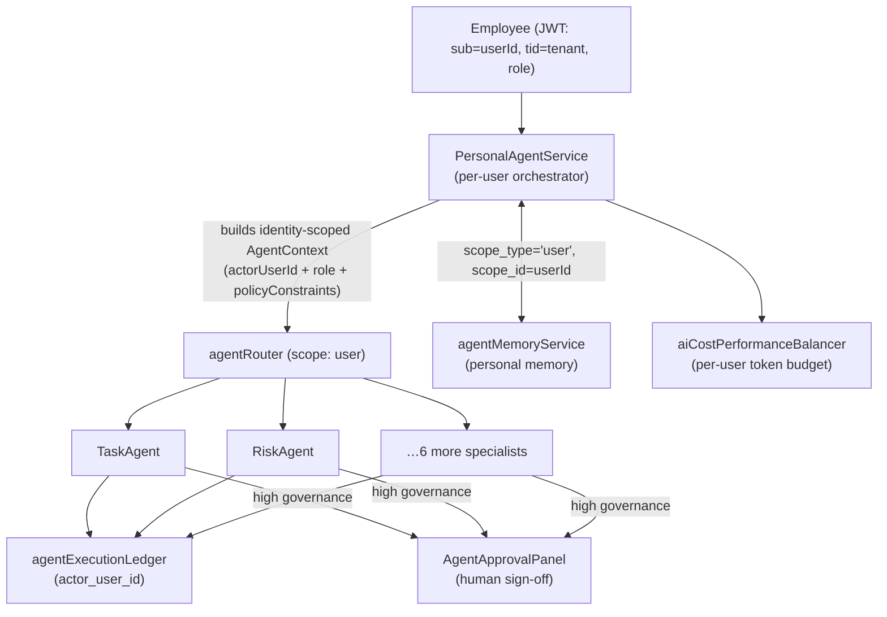

# ADR-012 — Per-User AI Agents

- **Status:** Proposed (2026-07-02)
- **Decider:** Denver Engineering — pending review
- **Related:** ADR-002 (specialist engines own execution), ADR-005 (AI capability registry); `api/services/agents/*`, `api/auth.ts`, `api/services/phase12/aiCostPerformanceBalancer.ts`

## Context
Denver's AI is a **capability-based multi-agent system**: eight function-specialized agents
(`TaskAgent`, `ValidationAgent`, `DocumentationAgent`, `RiskAgent`, `SchedulingAgent`,
`ResourceOptimizationAgent`, `IncidentResponseAgent`, `ReadinessCoordinatorAgent`) registered in
`agentRegistry.ts` and dispatched **by scope** (`project` / `workflow` / `action`) via `agentRouter.ts`.
Agents attach to *work*, not to *people*.

A recurring product ask is a **personal AI assistant per employee** — an agent that follows a user, knows
their work and preferences, acts within their permissions, and proactively surfaces what needs attention.
The naive reading ("8 agents per employee") is wrong and unaffordable. The right shape is a thin per-user
**orchestration + identity layer** over the existing shared specialist pool.

## Decision (proposed)
Introduce a **PersonalAgent**: a per-`userId` orchestrator/façade that carries the acting employee's
identity, role, permissions, and memory into every call it makes to the existing specialist agents. There
is **one PersonalAgent abstraction**, instantiated per user at request time — **not** N new agent types
per user.

### Reuse (no rebuild)
- **Memory is already scope-generic.** `agentMemoryService` keys on
  `(tenant_id, agent_type, scope_type, scope_id, key)`. Personal memory is a **new `MemoryScopeType`
  value `user`** with `scope_id = userId`. No table change.
- **`AgentContext`** already carries `scope`, `policyConstraints`, tenant — extend with `actorUserId` + role.
- **Identity** already in the JWT (`api/auth.ts`: `sub`/`tid`/`role`).
- **Audit / approval / handoff / task queue / tenant RLS** — reused unchanged.

### Net-new
| Component | File | Role |
|---|---|---|
| PersonalAgentService | `api/services/agents/personalAgentService.ts` | Resolve user → identity-scoped `AgentContext` → route to specialists → read/write `user`-scope memory |
| Identity-scoped routing | extend `agentRouter.ts` | Add `user` scope; propagate `actorUserId` so RBAC is the user's, not a service superuser |
| Personal assistant API | `api/routes/personalAgent.ts` | `POST /api/v1/me/agent/{ask,act}`, `GET /me/agent/memory` — `userId` derived from token, never the body |
| User agent profile (optional) | migration `0xx_user_agent_profiles.sql` | Per-user prefs: tone, autonomy ceiling, muted capabilities |
| Ledger attribution | add `actor_user_id` to `agent_executions` | Every action attributable to the employee |
| UI | "My Assistant" panel wired to My Work / "AI on" | Chat + suggested actions + approval inbox |

## Permissions & governance (the crux)
- PersonalAgent acts with **exactly the user's authority** — never broader. Thread `actorUserId` + `role`
  into `AgentContext`; specialists enforce RBAC/RLS against **that user**, not the process identity.
- **Autonomy ceiling** per user/role: below it → auto-execute; at/above → route to the existing
  `AgentApprovalPanel` (reuse `requiresApproval` / `governanceLevel`).
- Cross-user isolation: A's agent cannot read B's personal memory or act on records A can't see
  (tenant RLS + `user` scope). **Must be covered by explicit tests.**
- **Cost:** N users × (possibly background) agents = real Claude spend → enforce per-user token
  budgets/rate limits via `aiCostPerformanceBalancer`. Requires `ANTHROPIC_API_KEY`.

## Phasing
1. **MVP** — `user`-scope memory + PersonalAgentService + `/me/agent/ask` (read-only Q&A over My Work +
   personal memory; no writes). No new governance surface.
2. **Assisted actions** — agent *proposes*; actions land in the user's approval inbox. Nothing auto-runs.
3. **Bounded autonomy** — per-user autonomy ceiling auto-executes low-governance capabilities; full audit;
   cost budgets enforced.
4. **Proactive** — subscribe to the canonical event bus + schedulers to nudge users ("3 RFIs overdue").

## Consequences
- **Positive:** personal AI per employee with minimal new surface — mostly identity/permission propagation
  over existing infra; reuses audit, approval, memory, RLS.
- **Positive:** attribution and governance are first-class (ledger `actor_user_id`, approval gates).
- **Negative / risk:** RBAC scoping is the make-or-break — a bug leaks cross-user authority. Cost scales
  with headcount and proactivity. Proactive mode adds background load.
- **Trade-off (open):** true 1:1-per-user vs per-**role** templates (PM-agent, Field-agent) personalized
  via memory — role templates are cheaper and easier to govern.

## Open questions
1. **1:1 per user** vs **per-role templates** personalized by memory?
2. Default autonomy: **suggest-only** vs bounded auto-act?
3. Employee roster source: **SCIM/SAML** (samlify) vs the internal users table?
