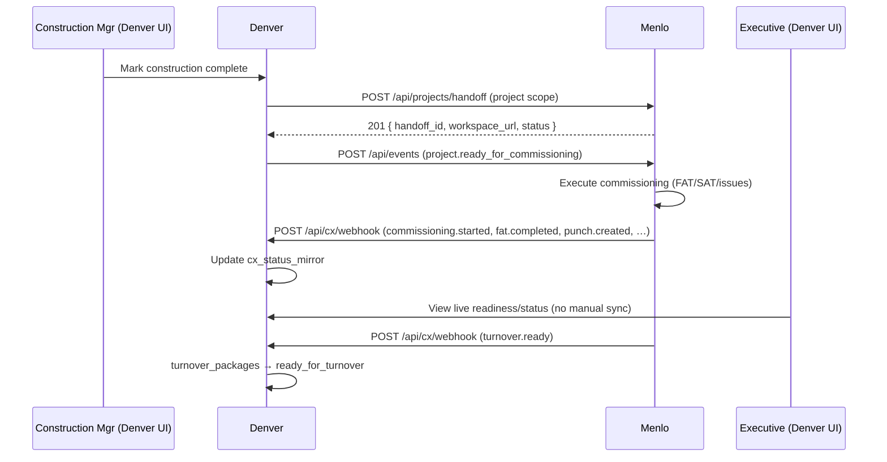

# Denver ↔ Menlo Interface Specification v1.0

**Status:** DRAFT for approval. Once approved this is the **single source of truth** for Epic 1
(Menlo Federation Adoption). Both repositories implement against this document; neither invents payloads.
Scope is intentionally minimal — only what Epic 1 needs. Future federation capabilities are out of scope
(see §10).

**Interface version:** `1.0` · **Event spec_version:** `1.0` · **Aligns to:** `ECOSYSTEM_INTEGRATION_CONTRACT.md`
(canonical events §4, object identity §3) and Denver's PR-1 primitives (`cx_status_mirror`,
`commissioningGateway`, `commissioningWebhook`, `cxEventMap`, `turnover_packages`).

---

## Section 1 — Overview

### Purpose
Define the contract that lets a customer experience a single workflow —
`Construction Complete → Menlo project → Commissioning → Status → Issues → Turnover` — without any manual
synchronization between the two systems.

### Repositories, ownership, responsibilities
| System | Owns | Responsibility in Epic 1 |
|---|---|---|
| **Denver** | EPC business workflow, project/portfolio, readiness, turnover planning, executive dashboards | Initiates handoff; consumes status/issues/turnover; renders executive visibility |
| **Menlo** | Commissioning **execution** (FAT/SAT/FPT/IST, punch, deficiency, NCR, witnessing, evidence) | Creates the commissioning project on handoff; executes; emits lifecycle events back |

**Boundary:** Denver never executes commissioning; Menlo never owns project/portfolio truth. They exchange
**events + references only** — no shared database, no cross-DB reads.

### Supported workflow (v1)


---

## Section 2 — Object References

All shared objects are referenced by **immutable id**; the producer owns the id, the consumer stores it as
a reference (and may map its own local/external id to it). No consumer mints another system's identity.

| Identifier | Owner | Format | Lifetime | Mutability | External-ID mapping |
|---|---|---|---|---|---|
| `tenant_id` (organization) | **Denver** | UUID v4 | org lifetime | immutable | Menlo stores as `organization.externalId` |
| `project_uuid` | **Denver** | UUID v4 | project lifetime | immutable | Menlo stores as `project.externalId`; **primary cross-system traceability key** |
| `handoff_id` | **Menlo** | string (Menlo-native, e.g. `hx_…`) | commissioning lifecycle | immutable | Denver stores in `cx_status_mirror.handoff_id`; **primary correlation key for status/events** |
| `system_uuid` | Denver (v1) → Crania (v2) | UUID/string | asset lifetime | immutable | **v1:** Denver-provided id, opaque to Menlo. Crania canonical identity is v2 (Epic 3) |
| `equipment_uuid` | Denver (v1) → Crania (v2) | UUID/string | asset lifetime | immutable | **v1:** Denver tag id, opaque to Menlo. Crania canonical identity is v2 |
| `test_uuid` | **Menlo** | string | test lifetime | immutable | Referenced by Menlo events; Denver treats as opaque deep-link target |
| `issue_uuid` (punch/deficiency/NCR) | **Menlo** | string | issue lifetime | immutable | Opaque to Denver; used for deep-links + counts |
| `turnover_id` | **Denver** | UUID (`turnover_packages.id`) | project lifetime | immutable | Denver maps `handoff_id → turnover_id` |

**v1 cut-line:** equipment/system identity is **Denver-provided and opaque to Menlo** (Menlo stores them as
external references). The Universal Object Service (canonical Crania equipment UUIDs + resolution API) is
**explicitly deferred to v2 / Epic 3** — Epic 1 does not require it.

---

## Section 3 — REST Contracts

Base URLs: `MENLO_BASE_URL` (Denver→Menlo), `DENVER_BASE_URL` (Menlo→Denver). All bodies are JSON
(`Content-Type: application/json`). All requests carry `X-Correlation-ID`.

### 3.1 `POST {MENLO}/api/projects/handoff`  (Denver → Menlo)
- **Purpose:** create/ensure the commissioning project for a Denver project.
- **Auth:** `Authorization: Bearer <COMMISSIONING_SVC_TOKEN>`.
- **Idempotency:** `Idempotency-Key: <uuid>` (required). Same key ⇒ same `handoff_id`, **200** (not a new project).
- **Request:**
```json
{
  "tenant_id": "8f1d…uuid",
  "project_uuid": "a2c4…uuid",
  "name": "Area 200 — Filtration",
  "scope": {
    "systems":    [{ "system_uuid": "SYS-200", "code": "FIL-200" }],
    "equipment":  [{ "equipment_uuid": "FIL-200-P01", "tag": "FIL-200-P01" }],
    "commissioning_items": [{ "id": "ci_1", "phase": "func", "equipment_uuid": "FIL-200-P01" }]
  },
  "deliverables": {
    "fat_procedure_url": "https://denver/…/packs/pk_1/download/pdf",
    "sat_procedure_url": "https://denver/…/packs/pk_2/download/pdf"
  },
  "callback_base": "https://denver/api/cx/webhook"
}
```
- **Response 201 (created) / 200 (idempotent replay):**
```json
{ "handoff_id": "hx_abc", "workspace_url": "https://menlo/ws/hx_abc", "status": "received" }
```
- **Errors:** `400` invalid payload · `401` bad/missing bearer · `409` project already handed off with a
  *different* idempotency key (conflict) · `422` scope references unresolvable · `5xx` Menlo error (Denver retries, §5).

### 3.2 `GET {MENLO}/api/projects/{handoff_id}/status`  (Denver → Menlo) — reconciliation/fallback
- **Purpose:** authoritative **absolute** snapshot (used to reconcile against streamed events).
- **Auth:** Bearer. **Idempotent/safe.** No side effects.
- **Response 200:**
```json
{
  "handoff_id": "hx_abc", "project_uuid": "a2c4…",
  "phase": "sat_testing",
  "fat": { "status": "passed", "readiness_pct": 100 },
  "sat": { "status": "in_progress", "readiness_pct": 60 },
  "counts": { "punch_open": 12, "deficiencies_open": 4, "ncr_open": 1 },
  "references": { "punch_url": "…", "deficiencies_url": "…", "ncr_url": "…" },
  "updated_at": "2026-06-28T12:00:00Z"
}
```
- **Errors:** `401` · `404` unknown handoff · `5xx`.

### 3.3 `POST {MENLO}/api/events`  (Denver → Menlo) — Denver-produced lifecycle events
- **Purpose:** Denver notifies Menlo of upstream lifecycle facts (readiness, construction complete).
- **Auth:** Bearer. **Idempotency:** `event_id` (Menlo dedupes). Body = the canonical envelope (§4).
- **Response:** `202 { "accepted": true }` · errors `401`/`400`/`5xx`.

### 3.4 `POST {DENVER}/api/cx/webhook`  (Menlo → Denver) — Menlo-produced events
- **Purpose:** Menlo streams commissioning lifecycle events to Denver.
- **Auth:** **HMAC-SHA256** (§6), `X-CX-Signature: sha256=<hex>` over the **raw body**, plus
  `X-CX-Timestamp`. No bearer.
- **Idempotency:** `(tenant_id, event_id)` ledger (`cx_inbound_events`). Duplicate ⇒ `200 {processed:false}`.
- **Response:** `200 { "ok": true, "processed": true|false }` (fast; processing is async) · `401` bad
  signature · `400` malformed/missing fields · `503` webhook not configured.

---

## Section 4 — Canonical Events

**Envelope (every event, both directions):**
```json
{
  "spec_version": "1.0",
  "event_id": "uuid",
  "event": "fat.completed",
  "tenant_id": "uuid",
  "project_uuid": "uuid",
  "handoff_id": "hx_abc",
  "subject_uuid": "FIL-200-P01",
  "occurred_at": "2026-06-28T12:00:00Z",
  "correlation_id": "uuid",
  "data": { }
}
```
- **Correlation ID:** flows end-to-end from the originating handoff; both systems log it.
- **Idempotency key:** `(tenant_id, event_id)`.
- **Replay behavior:** at-least-once delivery; consumers MUST be idempotent. Phase/status events are
  **last-writer** (apply latest). Count events SHOULD be reconciled against §3.2 `counts` (absolute) — see
  the ordering note below.

### 4.1 Denver → Menlo (to `/api/events`)
| Event (canonical) | Producer | Consumer | `data` | Notes |
|---|---|---|---|---|
| `project.ready_for_commissioning` | Denver | Menlo | `{}` | sent right after handoff |
| `construction.completed` | Denver | Menlo | `{ areas?: [...] }` | optional granularity |

### 4.2 Menlo → Denver (to `/api/cx/webhook`) and the mirror effect
| Event (canonical) | Menlo internal | `data` | Denver `cx_status_mirror` effect |
|---|---|---|---|
| `commissioning.started` | CommissioningStarted | `{}` | `phase = in_commissioning` |
| `fat.completed` / `fat.scheduled` | FATCompleted / FATScheduled | `{ readiness_pct? }` | `fat_status` = passed/scheduled |
| `sat.completed` / `sat.scheduled` | SATCompleted / SATScheduled | `{ readiness_pct? }` | `sat_status` = passed/scheduled |
| `loopcheck.completed` | LoopCheckCompleted | `{}` | log only |
| `punch.created` / `punch.closed` | PunchCreated / PunchClosed | `{ counts?: { punch_open } }` | `punch_open` ± (prefer absolute `counts`) |
| `deficiency.created` / `deficiency.closed` | DeficiencyCreated / DeficiencyResolved | `{ counts? }` | `deficiencies_open` ± |
| `ncr.created` / `ncr.closed` | NCRCreated / NCRClosed | `{ counts? }` | `ncr_open` ± |
| `evidence.verified`, `witness.signed` | EvidenceVerified / WitnessSigned | `{}` | log / reference |
| `turnover.ready` | TurnoverReady | `{}` | `phase = ready_for_turnover` |
| `commissioning.completed` | CommissioningCompleted | `{}` | `phase = accepted` |
| `report.published` | ReportPublished | `{ report_type, url, sha256 }` | store ref on turnover package |

**Ordering note (contract decision) — _Deltas are an optimization. Snapshots are the contract._**
Count events (`punch/deficiency/ncr`) are order-sensitive if applied as pure deltas. Under at-least-once +
out-of-order delivery, deltas drift. Therefore:
- **Menlo MUST include an absolute `counts` snapshot** in each issue event (`data.counts`). The snapshot is
  **authoritative**.
- **Deltas are optional** — a convenience for low-latency UI nudges only.
- **Denver MAY apply a delta for speed, but MUST reconcile to the snapshot** when present, and MUST treat
  the snapshot as the source of truth on any disagreement.
- Snapshots make issue counts **idempotent and order-independent** (re-applying any event converges to the
  same value), eliminating drift from duplicate or out-of-order delivery.
- Status/phase events are last-writer and safe; counts rely on snapshots. Denver additionally reconciles
  via §3.2 (see §11 Consistency Model).

---

## Section 5 — Timing Requirements
| Concern | Target |
|---|---|
| Project creation (handoff round-trip) | **< 30 s** |
| Status propagation (Menlo event → visible in Denver) | **< 30 s** |
| Issue propagation | **< 30 s** |
| Retry backoff (both directions) | exponential: 1s, 5s, 30s, 2m, 10m |
| Maximum retries | **5** then dead-letter |
| Dead-letter handling | persist failed delivery; alert; manual/automated replay via §3.2 reconciliation |

---

## Section 6 — Security
- **Bearer (Denver → Menlo):** `Authorization: Bearer <COMMISSIONING_SVC_TOKEN>`; Menlo validates; rotate
  via dual-token window.
- **Webhook signing (Menlo → Denver):** `X-CX-Signature: sha256=<HMAC-SHA256(raw_body, COMMISSIONING_WEBHOOK_SECRET)>`,
  constant-time compare. Body is verified **before** JSON parse (raw bytes).
- **Replay protection:** `X-CX-Timestamp` (unix seconds); reject if `|now - ts| > 300s` (clock-skew window
  ±5 min). Combined with the `(tenant_id, event_id)` idempotency ledger.
- **Secret rotation:** support two valid secrets during a rotation window (accept either signature).
- **Audit:** every handoff and event writes an audit entry keyed by `correlation_id` + `event_id`.
- **Correlation IDs:** `X-Correlation-ID` on every request; echoed; propagated into events.

---

## Section 7 — Failure Scenarios
| Scenario | Behavior / recovery |
|---|---|
| **Duplicate handoff** (same `Idempotency-Key`) | Menlo returns the existing `handoff_id`, **200**; no new project. **Zero duplicate creation.** |
| **Conflicting handoff** (same project, different key) | `409`; Denver does not retry; surfaces conflict. |
| **Out-of-order events** | phase/status last-writer; counts via absolute snapshot (§4) + §3.2 reconciliation. |
| **Webhook timeout** | Denver returns `2xx` fast and processes async; if Denver is slow/down Menlo retries w/ backoff then dead-letters. |
| **Partial failure** (event applied, mirror write fails) | idempotency ledger lets Menlo re-send safely; Denver re-applies idempotently. |
| **Menlo unavailable** | Denver queues outbound (handoff/events) and retries (§5); reads fall back to last mirror state; reconciles via §3.2 on recovery. |
| **Denver unavailable** | Menlo retries webhooks → dead-letter; on Denver recovery, Denver **reconciles** by calling §3.2 for active handoffs (authoritative absolute state). |

---

## Section 8 — Acceptance Tests (executable scenarios)

**AT-1 — Handoff creates a commissioning project (Slice 1).**
- *Preconditions:* Denver project `P` with scope; `COMMISSIONING_EXTERNAL` on; valid bearer.
- *Steps:* mark construction complete → Denver `POST /api/projects/handoff`.
- *Expected:* `201` with `handoff_id`+`workspace_url`; Denver stores them; turnover → `ready_for_commissioning`; audit entry written; **re-running the trigger creates no second project (200 idempotent)**.

**AT-2 — Live status appears in Denver < 30 s (Slice 2).**
- *Preconditions:* AT-1 done; webhook secret configured.
- *Steps:* Menlo emits `commissioning.started` then `fat.completed` to `/api/cx/webhook` (valid HMAC).
- *Expected:* `cx_status_mirror.phase = in_commissioning`, `fat_status = passed` within **30 s**; bad-signature event → `401`; duplicate `event_id` → no double-apply.

**AT-3 — Issues reflected (Slice 3).**
- *Steps:* Menlo emits `punch.created` (counts: punch_open=12), `deficiency.created` (deficiencies_open=4).
- *Expected:* Denver shows punch_open=12, deficiencies_open=4 + deep-links within 30 s; out-of-order replays converge to the absolute snapshot.

**AT-4 — Executive readiness (Slice 4).**
- *Steps:* open Denver exec dashboard for an in-commissioning project.
- *Expected:* live phase + FAT/SAT readiness % + open counts + "synced at" timestamp; no manual entry.

**AT-5 — Turnover sync (Slice 5).**
- *Steps:* Menlo emits `turnover.ready` then `report.published`.
- *Expected:* turnover state → `ready_for_turnover`; report ref stored + visible; owner reviews without manual assembly.

**AT-6 — Resilience.**
- *Steps:* take Denver offline; Menlo emits 3 events; bring Denver up.
- *Expected:* Menlo retried + dead-lettered; on recovery Denver reconciles via §3.2 to the correct absolute state.

---

## Section 9 — Contract Test Fixture Catalog
Shared JSON fixtures both repos test against (Denver validates inbound/outbound shaping; Menlo validates
the same). **Versioned home (immutable):** `docs/interfaces/fixtures/denver-menlo/v1/` — e.g.
`docs/interfaces/fixtures/denver-menlo/v1/handoff_request.json`,
`docs/interfaces/fixtures/denver-menlo/v1/commissioning_started.json`,
`docs/interfaces/fixtures/denver-menlo/v1/fat_completed.json`,
`docs/interfaces/fixtures/denver-menlo/v1/turnover_ready.json`.

**Fixture evolution rules (never overwrite):**
- Published fixtures are **immutable** — a published `v1/` fixture is never edited in place (both repos pin
  to its bytes).
- **Additive only within `v1/`:** new example fixtures may be added to `v1/` *only if* every existing
  consumer still parses them (backward-compatible).
- **Breaking fixture changes require a new `v2/` folder** (`docs/interfaces/fixtures/denver-menlo/v2/`),
  paired with interface `2.0` (§10).
- File paths in this catalog are always version-qualified — no unversioned fixture paths.

| Fixture | Direction | Purpose |
|---|---|---|
| `handoff_request.json` | D→M | canonical handoff body |
| `handoff_response_201.json` / `handoff_response_200_idempotent.json` | M→D | created / replay |
| `status_response.json` | M→D | §3.2 absolute snapshot |
| `event_project_ready_for_commissioning.json` | D→M | envelope sample |
| `event_construction_completed.json` | D→M | envelope sample |
| `event_commissioning_started.json` | M→D | mirror=in_commissioning |
| `event_fat_completed.json` / `event_sat_completed.json` | M→D | status setters |
| `event_punch_created.json` / `event_punch_closed.json` | M→D | counts (absolute + delta) |
| `event_deficiency_created.json` / `event_ncr_created.json` | M→D | counts |
| `event_turnover_ready.json` | M→D | phase=ready_for_turnover |
| `event_report_published.json` | M→D | doc ref |
| `error_401_bad_signature.json` / `error_409_conflict.json` / `error_400_malformed.json` | — | error contracts |

Each fixture includes the full envelope + `data`; both teams add a contract test that asserts their
serializer/parser round-trips the fixture byte-for-field.

---

## Section 10 — Versioning
- **Interface version `1.0`** (this doc) and **event `spec_version: "1.0"`** travel on every payload.
- **Compatibility:** additive changes (new optional field / new event) stay within `1.x`; consumers
  **ignore unknown fields**. Breaking changes (remove/rename/retype, semantic change) require a new major
  (`2.0`) with a coexistence window.
- **Deprecation:** announce in the spec; keep deprecated fields/events ≥ one compatibility window.
- **Future extensions (NOT in v1):** Crania canonical equipment/system UUIDs via the Universal Object Service
  (Epic 3); AI-artifact governance envelope on AI-generated commissioning outputs (Epic 4); capability-
  registry-mediated calls; knowledge-graph edges. These arrive as `1.x` additive fields or `2.0` per the
  rules above — not in this contract.

---

## Section 11 — Consistency Model

### Event model
- **At-least-once delivery** — every event may arrive more than once and out of order.
- **Event-driven updates** — Denver updates its mirror on each event for low latency.
- **Eventual consistency** — the mirror converges to Menlo's truth; it is not transactionally coupled.
- **Consumers MUST be duplicate-tolerant** (dedupe on `(tenant_id, event_id)`).
- **Consumers MUST be out-of-order-tolerant** (phase = last-writer; counts = absolute snapshot, §4).

### Mirror model
Denver maintains a **commissioning mirror** (`cx_status_mirror`) of Menlo state. **Denver mirrors Menlo;
Denver never authors commissioning-execution state.** The mirror is a read-model for Denver UX/reporting.

### Source of truth
| Menlo owns | Denver owns |
|---|---|
| commissioning execution; test execution; FAT/SAT/FPT/IST state; issue state; evidence collection; turnover **readiness signal** | portfolio reporting; executive dashboards; EPC workflow state; project readiness; turnover **orchestration/workflow**; document-control references |

### Reconciliation model
Every fast event update is backed by periodic/triggered reconciliation against the authoritative snapshot:
```text
Menlo event → Denver mirror update → ACK (2xx)
            → background reconciliation
            → GET /api/projects/{handoff_id}/status
            → correct drift if mirror ≠ snapshot
            → audit the reconciliation result
```
Triggers: on each `*.completed`/phase change, on reconnect after an outage, and on a periodic timer
(see §13 SLA: drift corrected < 15 min). **Events provide fast updates; reconciliation provides
correctness.**

---

## Section 12 — Conflict Resolution

Deterministic ownership rules — no ad-hoc resolution during implementation.

| Disagreement | Winner | Rationale |
|---|---|---|
| Commissioning execution status (phase, FAT/SAT/FPT/IST) | **Menlo** | Menlo owns execution |
| Project metadata owned by Denver (name, scope, org/project ids) | **Denver** | Denver owns the project |
| Issue counts (punch/deficiency/NCR) | **Menlo snapshot** | snapshot is authoritative |
| Event delta vs snapshot | **Snapshot** | _deltas are an optimization; snapshots are the contract_ (§4) |
| Turnover readiness signal | **Menlo** | readiness is an execution fact |
| Turnover package workflow state | **Denver** | Denver orchestrates turnover |
| Document-control record (revision/approval/status) | **Denver** | Denver owns document control |
| Rendered document content | **EAP (Crania)** | EAP is the document authority |
| Object identity (project/org) | **Denver** | Denver mints these ids |
| Object identity (test/issue/handoff) | **Menlo** | Menlo mints these ids |

On any unresolved disagreement the **owning system per the table wins**; Denver corrects its mirror toward
the owner's value and audits the correction.

---

## Section 13 — Business SLAs

Customer-facing expectations (not low-level performance guarantees; may be tightened after production
observation).

| Outcome | Target |
|---|---|
| Project handoff visible in Menlo | **< 30 s** |
| Commissioning status visible in Denver | **< 30 s** |
| Issue counts visible in Denver | **< 30 s** |
| Readiness rollup visible in executive dashboard | **< 60 s** |
| Turnover-ready signal visible in Denver | **< 5 min** |
| Reconciliation drift correction | **< 15 min** |
| Critical webhook-failure alert | **< 5 min** |

These are **business SLAs** — the experience customers should perceive — backed by the timing budgets in
§5 and the reconciliation model in §11.

---

## Section 14 — Contract Review Notes

Deliberate scoping decisions for v1 (so reviewers and implementers know what is *intentionally* excluded):
- **v1 uses opaque references, not the full Universal Object Service.** Equipment/system ids are
  Denver-provided and opaque to Menlo (§2). UOS-backed canonical Crania identities are a v1.x/v2.0 evolution.
- **v1 avoids full MCP / service-to-service federation.** Denver→Menlo is Bearer REST; Menlo→Denver is
  HMAC webhook. The Denver MCP provider and capability-registry-mediated calls are out of scope.
- **v1 keeps commissioning execution entirely in Menlo.** Denver does not execute or author execution state.
- **v1 keeps Denver as mirror + orchestrator.** Denver reflects Menlo and owns EPC/portfolio/turnover
  workflow.
- **Evolution path:** these can grow to UOS-backed canonical identities and richer federation in v1.x
  (additive) or v2.0 (breaking), per §10 — none of that is required for Epic 1.

---

## Error Matrix (quick reference)
| Endpoint | 200/201/202 | 400 | 401 | 404 | 409 | 422 | 5xx |
|---|---|---|---|---|---|---|---|
| `POST /api/projects/handoff` | created/replay | invalid body | bad bearer | — | dup w/ diff key | unresolvable scope | retry |
| `GET /api/projects/{id}/status` | snapshot | — | bad bearer | unknown handoff | — | — | retry |
| `POST /api/events` (→Menlo) | 202 accepted | invalid | bad bearer | — | — | — | retry |
| `POST /api/cx/webhook` (→Denver) | ok(processed) | malformed/missing | bad signature | — | — | — | (Menlo retries) |

---

**Success criterion:** with this spec approved, Denver and Menlo teams implement independently against the
same envelopes, endpoints, auth, timing, and fixtures — and interoperate **by construction**.
