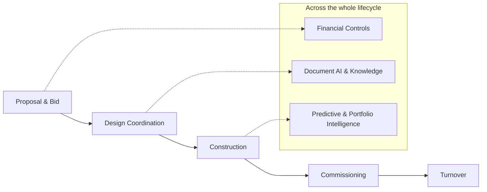
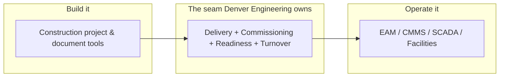
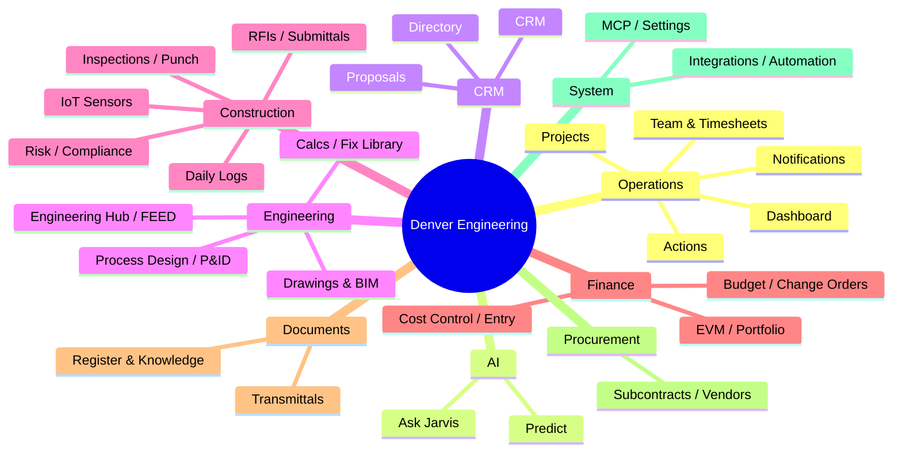
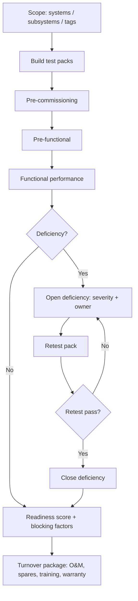
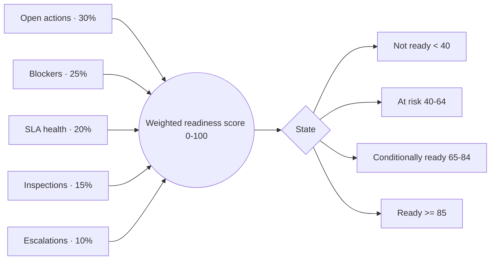
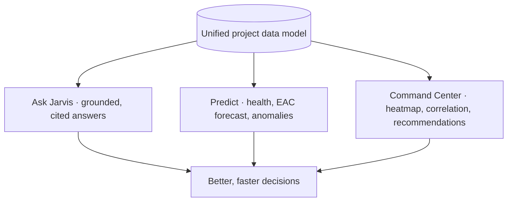
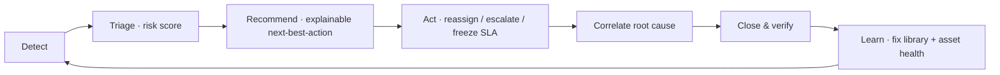
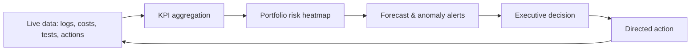
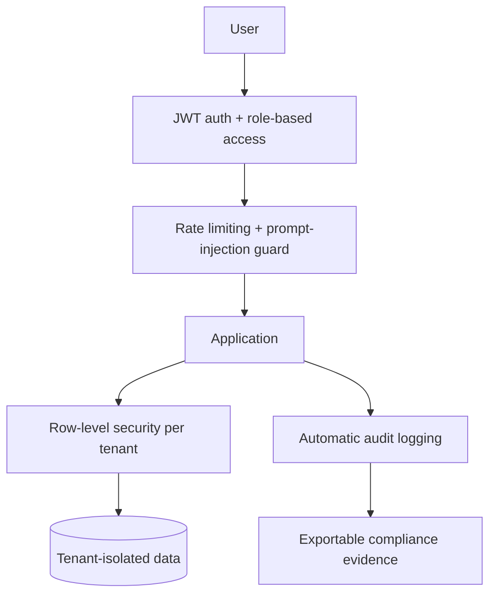
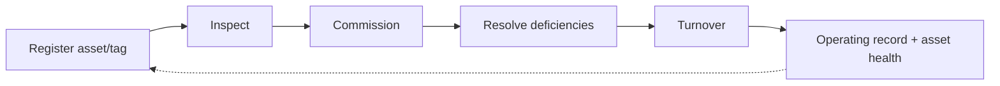

# Diagrams

Renderable diagrams for the presentation. All blocks are [Mermaid](https://mermaid.js.org) — paste into any Mermaid-capable renderer (or the Mermaid Live Editor) to export SVG/PNG for slides.

---

## 1. Project lifecycle ribbon

---

## 2. The "build-to-operate seam" (positioning)

---

## 3. Nine work domains

---

## 4. Commissioning workflow (signature)

---

## 5. Readiness scoring model

---

## 6. The intelligence layer

---

## 7. Issue-to-resolution operations loop

---

## 8. Data-to-decisions (executive reporting)

---

## 9. Security & trust layers

---

## 10. Asset lifecycle ring

---

*Convert any diagram to a branded slide graphic using `BRAND_AND_STYLE.md`. Slide-specific build guidance is in `SLIDE_GRAPHICS_SPEC.md`.*
